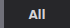
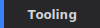
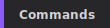
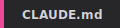
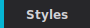
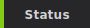

<!-- GENERATED FILE: do not edit directly -->
<!--lint disable remark-lint:awesome-badge-->

<h3 align="center">Pick Your Style:</h3>

# Awesome Claude Code (Flat)

A flat list view of all resources. Category: **Tooling** | Sorted: by latest release (30 days)

---

## Sort By:

  
  
  
  

<strong>Category:</strong>

  
  
  
  
  
  
  
  
  
  
  

<em>Currently viewing: **Tooling** sorted by latest release (30 days) (past 30 days)</em>

---

## Resources

> **Note:** Latest release data is pulled from GitHub Releases only. Projects without GitHub Releases will not show release info here. Please verify with the project directly.

<table>
<thead>
<tr>
<th>Resource</th>
<th>Version</th>
<th>Source</th>
<th>Release Date</th>
<th>Description</th>
</tr>
</thead>
<tbody>
<tr>
<td><a href="https://github.com/lis186/ccxray"><b>ccxray</b></a> by <a href="https://github.com/lis186">lis186</a></td>
<td>v1.2.5</td>
<td>GitHub</td>
<td>2026-04-11</td>
<td>A transparent HTTP proxy and real-time dashboard that sits between Claude Code and the Anthropic API. Captures every request and response without configuration, presenting them in a Miller-column interface with session grouping, token/cost tracking, and context-window visualization.</td>
</tr>
<tr>
<td colspan="5">        </td>
</tr>
<tr>
<td><a href="https://github.com/rullerzhou-afk/clawd-on-desk"><b>Clawd on Desk</b></a> by <a href="https://github.com/rullerzhou-afk">Ruller_Lulu</a></td>
<td>v0.5.10</td>
<td>GitHub</td>
<td>2026-04-06</td>
<td>A desktop pet that reacts to your Claude Code sessions in real-time — thinking, typing, juggling, sleeping, and more. Yep. It's undeniably endearing. And at the end of the day, isn't that what Claude Code is all about?</td>
</tr>
<tr>
<td colspan="5">        </td>
</tr>
<tr>
<td><a href="https://github.com/matt1398/claude-devtools"><b>claude-devtools</b></a> by <a href="https://github.com/matt1398">matt1398</a></td>
<td>v0.4.9</td>
<td>GitHub</td>
<td>2026-03-23</td>
<td>A well-designed desktop app that provides detailed observability into your Claude Code sessions by analyzing the session logs. Provides turn-based context data across numerous categories, compaction visualization, subagent execution trees, and custom notification triggers. Easy to install, and nice visual design.</td>
</tr>
<tr>
<td colspan="5">        </td>
</tr>
<tr>
<td><a href="https://github.com/agent-sh/agnix"><b>agnix</b></a> by <a href="https://github.com/agent-sh">agent-sh</a></td>
<td>v0.16.5</td>
<td>GitHub</td>
<td>2026-03-23</td>
<td>A comprehensive linter for Claude Code agent files. Validate CLAUDE.md, AGENTS.md, SKILL.md, hooks, MCP, and more. Plugin for all major IDEs included, with auto-fixes.</td>
</tr>
<tr>
<td colspan="5">        </td>
</tr>
</tbody>
</table>

---

**Total Resources:** 4

**Last Generated:** 2026-04-21
