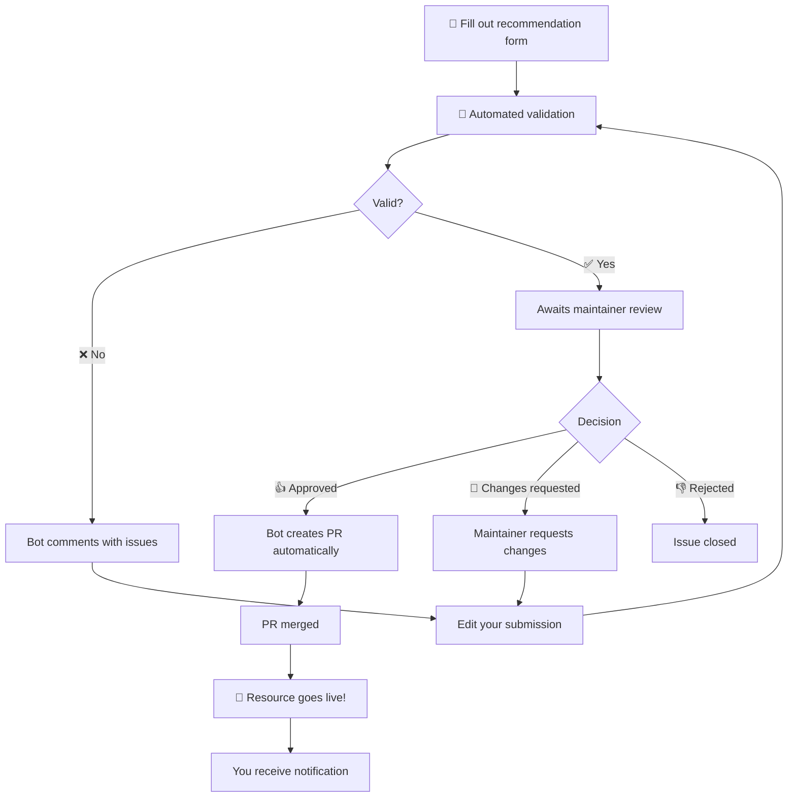

# Contributing to Awesome Claude Code

Please take a moment to read through this docoument if you plan to submit something for recommendation.

> [!WARNING]
> Due to aggressive spamming of the repository's recommendation system, strict measures are in place to ensure that submissions are made accoring to the requirements stated in this document. The penalties are harsh, but compliance is very easy, and any well-meaning user who reads this document is unlikely to be affected. In additiion, please note that a temporary ban is also in place for any submissions relating to OpenClaw. I hope that these incidents were the result of a few irresponsible users, and not reflective of the OpenClaw community as a whole, and I'm sure this will be removed in the near future, but it is deemed necessary as a palliative measure. See [here](COOLDOWN.md) for list of rules.

- I am very grateful to receive recommendations from the visitors to this list. But be aware that there is no formal submission/review process at the moment. My responsibility is to share links to awesome things. One way I find out about awesome things is via the repo's issues, and I'm very grateful to everyone who shares their amazing work. But it's not the only way, and creating an issue does not represent any sort of contract.
- Bear in mind that the point of an Awesome List is to be *selective* - I cannot recommend every single resource that is submitted.
- Although many awesome resources are inter-operable, we especially welcome and invite recommendations of resources that focus on the unique features and functionality of Claude Code. This is not a hard requirement but it is a guideline.
- I'm constantly trying to improve the way in which recommendations can be submitted, and to provide clear guidance to users who wish to share their work. Here are some of those guidelines:
    - security is of the utmost importance. I'm unlikely to install any software unless I have high confidence that it is free of malware, spyware, adware, or bloat. If a resource involves executing a shell script, for example, it is recommended to supply clear and thorough comments explaining exactly what it does.
    - If your library makes any network calls except to Anthropic servers; modifies shared system files; involves any form of telemetry; or requires "bypass-permissions" mode, this must be stated very clearly.
    - Do not submit resources that do not comply with the licensing rights of other developers. Make sure you understand what OSS licenses require.
    - I value _focused_ resources with a clear purpose and use value. Even if you have a marketplace full of awesome plugins, you are encouraged to select one, or a small subset.
    - Claims about what a resource does have to be evidence-based - and you should not expect me, or probably any user, to do the work of proving it themselves. If you can provide a video demonstrating the effectiveness of a skill, e.g., this is tremendously helpful. Otherwise, provide instructions for validating the claims made in the description, and make them as detailed as possible. "Install this library into your favorite project and watch the magic happen" - no. "Clone this demo repository and install the plugin; give Claude the following prompt: ..." - yes.
    - Put a tiny bit of time and effort into your README. It's a shame that developers will put so much effort into a project and then let an agent write the README and hardly give it any thought. 

## How to Recommend a Resource

**NOTE: ALL RECOMMENDATIONS MUST BE MADE USING THE WEB UI ISSUE FORM TEMPLATE, OR YOU RISK BEING BANNED FROM INTERACTING WITH THIS REPOSITORY TEMPORARILY OR PERMANENTLY.**

First, make sure you've read the above information. Second, make sure you've read, and agree with, the [Code of Conduct](./CODE_OF_CONDUCT.md). Then:

### **[Click here to submit a new resource](https://github.com/hesreallyhim/awesome-claude-code/issues/new?template=recommend-resource.yml)**

Do not open a PR. Just fill out the form. If there are any issues with the form, the bot will notify you. (A notification from the bot that your recommendation needs some changes in formatting are not related to the warning above, which mainly applies to submissions that attempt to bypass the GitHub Web UI issue form entirely. You need not worry that formatting errors alone will incur a ban.)

> [!Warning]
> It is **not** possible to submit a resource recommendation using the `gh` CLI.

Although resources themselves may be partially or entirely written by a coding agent, resource recommendations must be created by human beings. 

### The Recommendation Process

The entire recommendation process is managed via automation - even the maintainer does not use PRs to add entries to the list. The bot is really good at it. Here's what happens when you submit a resource for recommendation:



### What the Bot Validates

When you submit a resource, the bot checks:

- All required fields are filled
- URLs are valid and accessible
- No duplicate resources exist
- License information (when available)
- Description length and quality

The bot's validation is not any sort of review. It's merely a formal check.

## Other Contributions

### Suggesting Improvements

For suggestions about the repository structure, new categories, or other enhancements:

1. **[Open a general issue](https://github.com/hesreallyhim/awesome-claude-code/issues/new)**
2. Describe your suggestion clearly
3. Explain the benefit to the community

Or, alternatively, start a thread in the [Discussions](https://github.com/hesreallyhim/awesome-claude-code/discussions) tab. All opinions are welcome in this repo so long as they are expressed in accordance with the Code of Conduct. It's very nice to interact with people who visit the list.

## Badges

If your submission is approved, you are invited to add a badge to your project's README:

[](https://github.com/hesreallyhim/awesome-claude-code)

```markdown
[](https://github.com/hesreallyhim/awesome-claude-code)
```

Or the flat version:

[](https://github.com/hesreallyhim/awesome-claude-code)

```markdown
[](https://github.com/hesreallyhim/awesome-claude-code)
```

## GitHub Repository Notifications

If your resource is on GitHub, our automated system will create a friendly notification issue on your repository informing you of the inclusion and providing badge options.

## Technical Details

For more information about how the repository works, including the automated systems, validation processes, the "multi-list design and technical architecture, see the documents in `docs/` - in particular `README_GENERATION`.

---

Thank you for taking the time to read this and to share your project (or any project).
